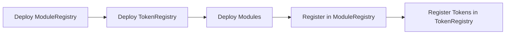
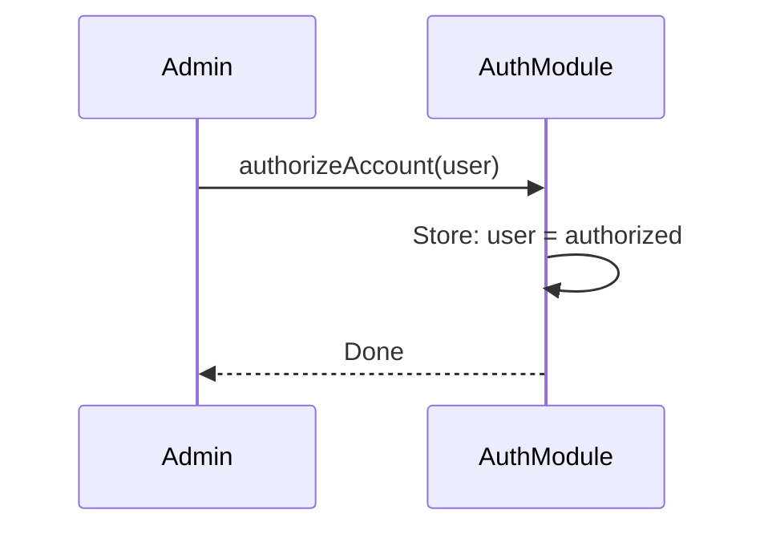
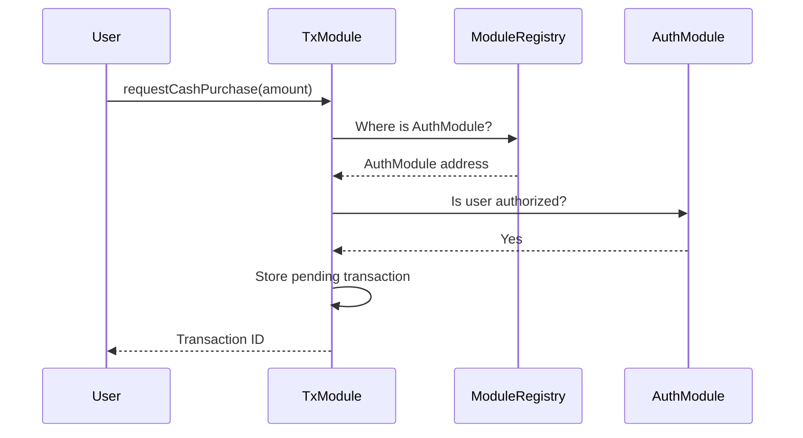
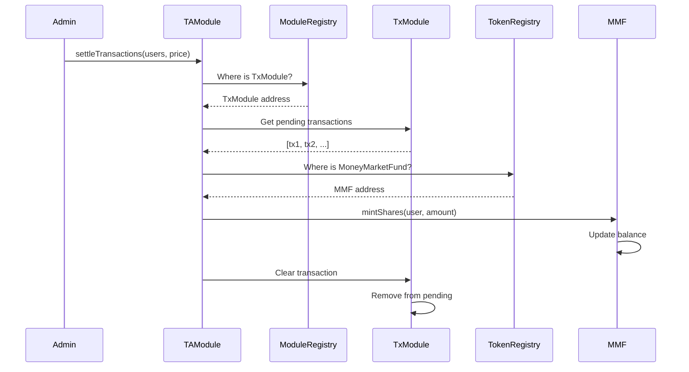
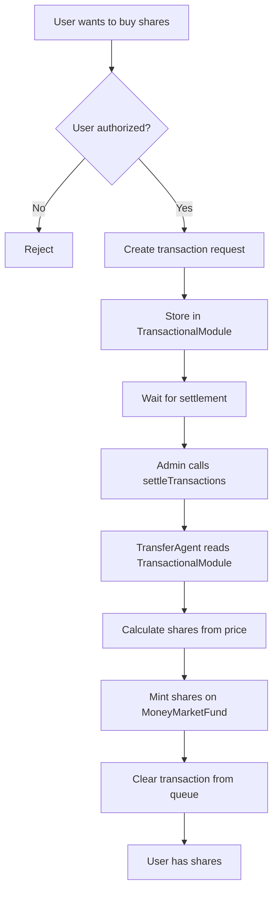

# Architecture

- Modules don't hardcode addresses
- Swap implementations without redeploying dependents
- Single source of truth for addresses

## Foundation: Registries + Base

**ModuleRegistry** → Maps `bytes32` module IDs → addresses  
**TokenRegistry** → Maps `string` token names → addresses  
**BaseModule** → Abstract base: upgradeability (UUPS) + registry reference

## How They Connect

All modules inherit `BaseModule`, which stores `ModuleRegistry modules`.

```solidity
// Every module can find others:
address auth = modules.getModuleAddress(keccak256("MODULE_AUTHORIZATION"));
```

Modules read `TokenRegistry` via initialization params to get token addresses.

## Inheritance Chain

```
BaseModule
├─ Initializable (OpenZeppelin)
└─ UUPSUpgradeable (OpenZeppelin)
   └─ stores: ModuleRegistry modules

AuthorizationModule
├─ BaseModule
├─ AccessControlEnumerableUpgradeable
└─ interfaces: IAuthorization, IAccountManager

TransactionalModule
├─ BaseModule
├─ AccessControlEnumerableUpgradeable
└─ interfaces: IShareholderTransaction, IExtendedTransactionDetail, ...

TransferAgentModule
├─ BaseModule
├─ AccessControlEnumerableUpgradeable
└─ interfaces: ITransferAgentExt, IRecovery, ITransferAgentXChain

MoneyMarketFund
├─ Initializable
├─ ERC20Upgradeable
├─ AccessControlUpgradeable
├─ UUPSUpgradeable
└─ interfaces: IHoldings, IAdminTransfer

ModuleRegistry → Ownable
TokenRegistry → Ownable
```

## Flow

1. Deploy `ModuleRegistry`, `TokenRegistry`
2. Deploy modules (inherit `BaseModule`)
3. Initialize modules with registry addresses
4. Modules use `modules.getModuleAddress()` to find each other
5. Modules use `TokenRegistry.getTokenAddress()` to find tokens


# Data Flow

## The Three Layers

**Registries** → Phone book (where to find things)  
**Modules** → Workers (do the work)  
**Tokens** → Assets (what people own)

## Simple Data Flow

```
1. Admin registers modules/tokens in registries
2. Modules read registries to find each other
3. User requests transaction → stored in TransactionalModule
4. Admin settles → TransferAgentModule reads TransactionalModule, updates Token
```

## Registry Pattern

**ModuleRegistry** = "Where is AuthorizationModule?"  
**TokenRegistry** = "Where is MoneyMarketFund?"

Every module stores `ModuleRegistry` address. When it needs another module:
```solidity
address auth = modules.getModuleAddress("MODULE_AUTHORIZATION");
```

## Data Flow Diagrams

### Setup Flow


### Authorization Flow


### Transaction Request Flow


### Settlement Flow


## Key Concept: Registry Lookup

All modules have this pattern:
```solidity
// In any module:
address authModule = modules.getModuleAddress("MODULE_AUTHORIZATION");
address token = tokenRegistry.getTokenAddress("MMF");
```

This lets modules find each other without hardcoded addresses.

## Complete Flow Example



## Inheritance (Simple)

```
BaseModule (abstract)
  ├─ stores ModuleRegistry reference
  ├─ provides upgradeability
  └─ inherited by:
      ├─ AuthorizationModule
      ├─ TransactionalModule
      └─ TransferAgentModule
```

All modules share: upgradeability + registry access.
```

**Takeaway:** Registries are directories. Modules look up addresses, read data, and update tokens. No hardcoded addresses.