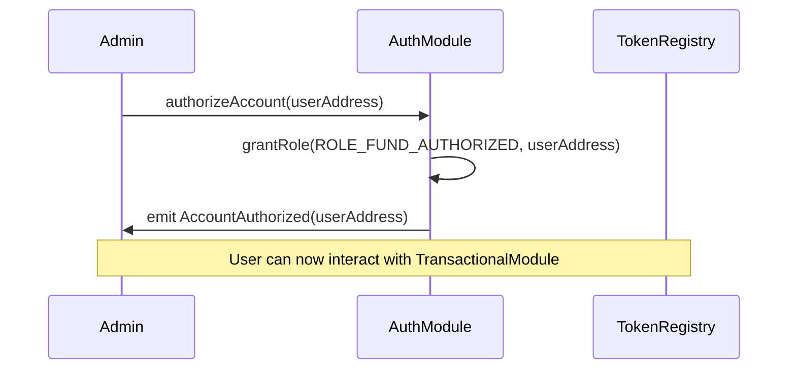
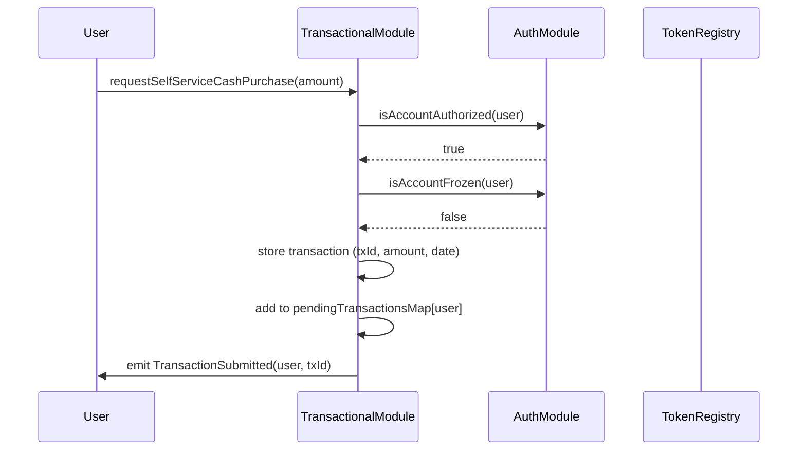
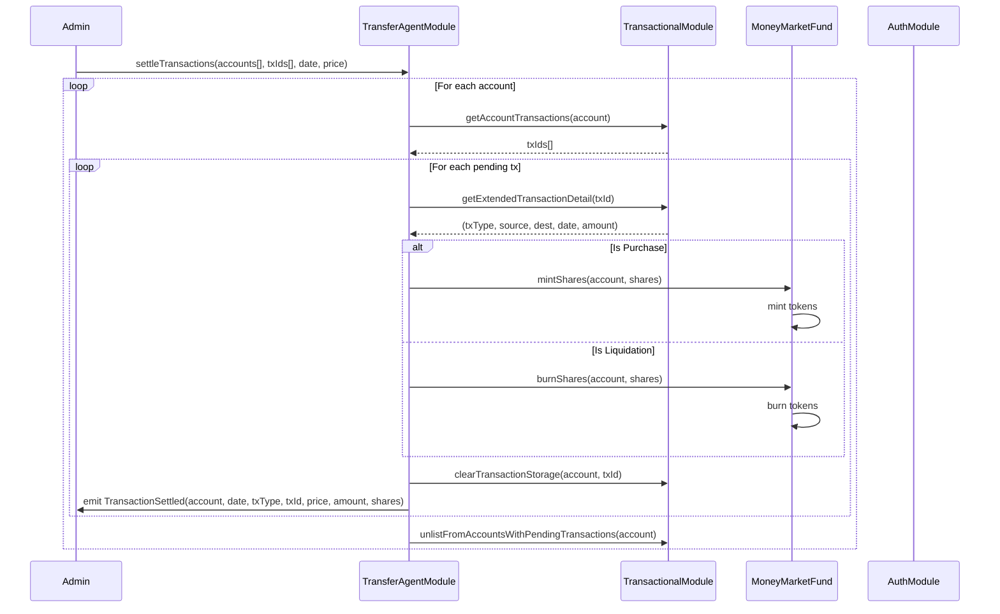
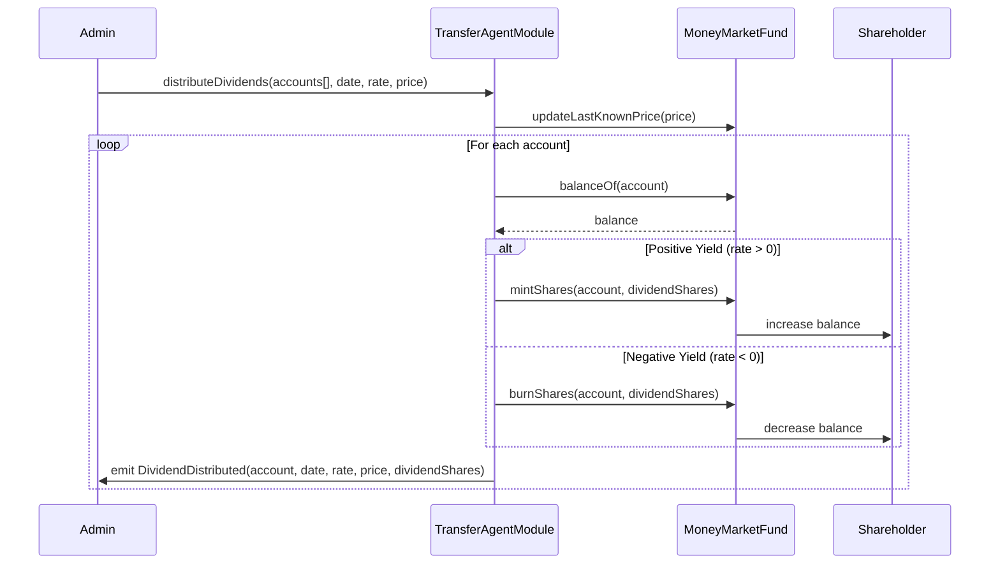
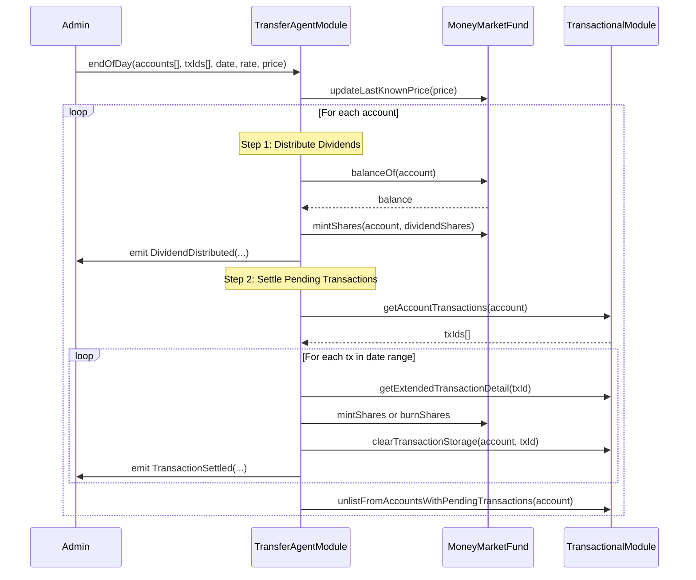
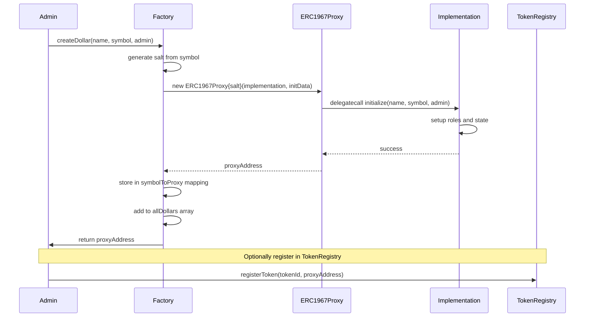
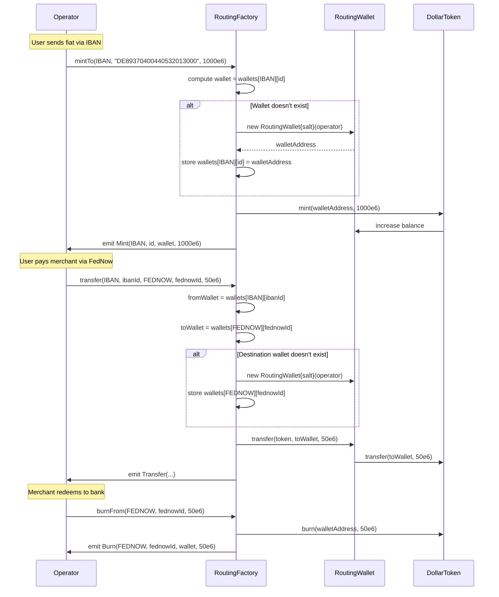
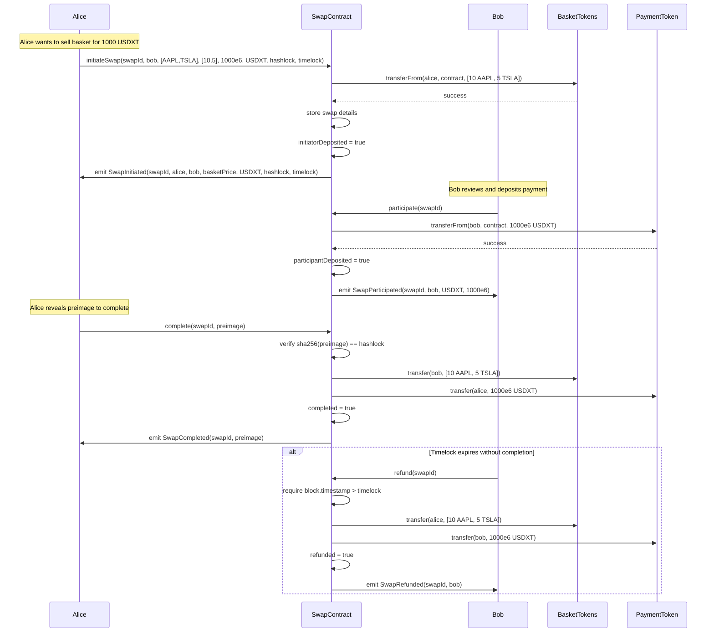
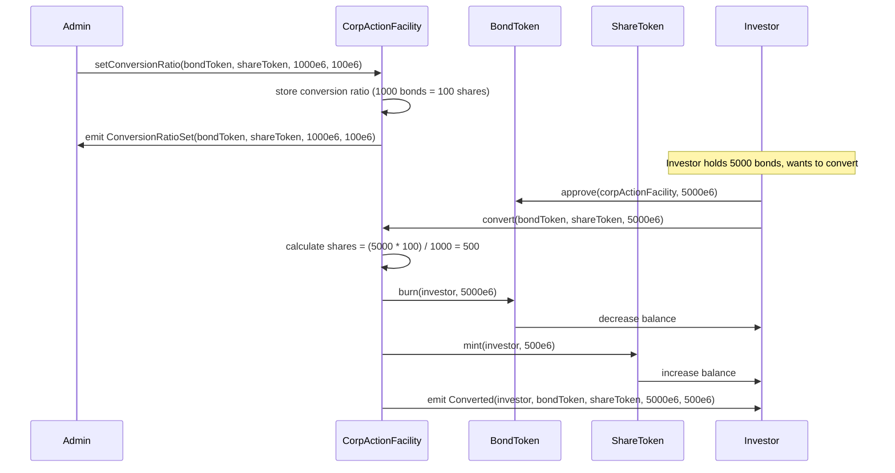
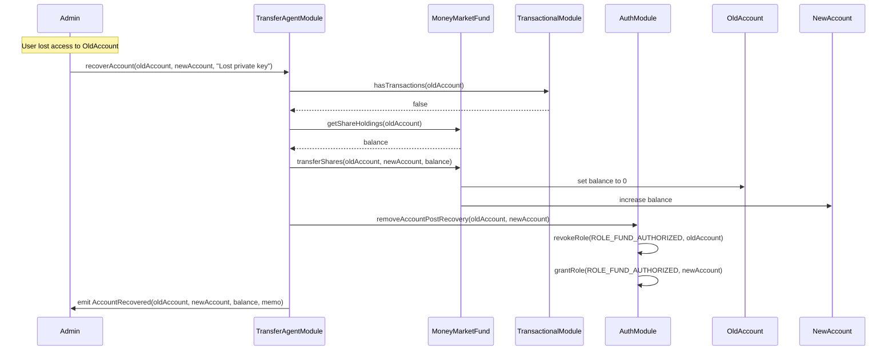

## Architecture 


### Inheritance

```
BaseModule
-AuthorizationModule
-TransactionModule
-TransferAgentModule
```

BaseModule = parent

### CORE MODULES

1. ```BaseModule``` Parent module template
2. ```AuthorizationModule``` RBAC for shareholder accounts
3. ```TransactionalModule``` Pending transaction queue & clearing
4. ```TransferAgentModule``` Settlement, dividends, corporate actions
5. ```ModuleRegistry``` Module registration & wiring
6. ```TokenRegistry``` Collateral master file & whitelist


### CORE FUNCTION

- Registry manages modules/tokens
- Modules query registries
- AuthorizationModule authorizes TransactionalModule
- TransactionalModule settles via TransferAgentModule
- TransferAgentModule mints/burns Asset Tokens
- Factories create Token proxies
- Routing system creates wallets and mints/burns Dollar
## Contract Catalog

### Registry Layer

**ModuleRegistry.sol**
- registerModule(bytes32 moduleId, address moduleAddress)
- getModuleAddress(bytes32 moduleId) returns address
- getModuleVersion(bytes32 moduleId) returns uint8

**TokenRegistry.sol**
- registerToken(string tokenId, address tokenAddress)
- getTokenAddress(string tokenId) returns address

### Module Layer

**BaseModule.sol** (Abstract)
- __BaseModule_init(address moduleRegistry)
- getVersion() returns uint8

**AuthorizationModule.sol** (RBAC & Account Management)
- authorizeAccount(address account)
- deauthorizeAccount(address account)
- freezeAccount(address account, string memo)
- unfreezeAccount(address account, string memo)
- isAccountAuthorized(address account) returns bool
- isAccountFrozen(address account) returns bool
- isAdminAccount(address account) returns bool
- removeAccountPostRecovery(address from, address to)

**TransactionalModule.sol** (Pending Transaction Queue)
- requestCashPurchase(address account, uint256 amount, uint256 date)
- requestCashLiquidation(address account, uint256 amount, uint256 date)
- requestFullLiquidation(address account, uint256 date)
- requestShareTransfer(address from, address to, uint256 shares, uint256 date)
- requestSelfServiceCashPurchase(uint256 amount)
- requestSelfServiceCashLiquidation(uint256 amount)
- requestSelfServiceFullLiquidation()
- requestSelfServiceShareTransfer(address to, uint256 shares)
- cancelRequest(address account, bytes32 txId, string memo)
- cancelSelfServiceRequest(bytes32 txId, string memo)
- clearTransactionStorage(address account, bytes32 txId)
- getAccountTransactions(address account) returns bytes32[]
- hasTransactions(address account) returns bool
- getExtendedTransactionDetail(bytes32 txId) returns tuple
- enableSelfService(bool enable)

**TransferAgentModule.sol** (Settlement & Corporate Actions)
- distributeDividends(address[] accounts, uint256 date, int256 rate, uint256 price)
- distributeDividends(address[] accounts, uint256[] adjustedShares, uint256 date, int256 rate, uint256 price)
- settleTransactions(address[] accounts, bytes32[] txIds, uint256 date, uint256 price)
- endOfDay(address[] accounts, bytes32[] txIds, uint256 date, int256 rate, uint256 price)
- endOfDay(address[] accounts, uint256[] adjustedShares, bytes32[] txIds, uint256 date, int256 rate, uint256 price)
- settleCXTransaction(address account, bytes32 requestId, uint256 date, uint256 price)
- settleCXTransactions(address account, bytes32[] requestIds, uint256 date, uint256 price)
- adjustBalance(address account, uint256 currentBalance, uint256 newBalance, string memo)
- recoverAccount(address from, address to, string memo)
- recoverAsset(address from, address to, uint256 amount, string memo)

### Token Layer

**Dollar.sol** (Rebasing USD Token)
- mint(address to, uint256 amount)
- burn(address from, uint256 amount)
- transfer(address to, uint256 amount) returns bool
- transferFrom(address from, address to, uint256 amount) returns bool
- approve(address spender, uint256 amount) returns bool
- permit(address owner, address spender, uint256 value, uint256 deadline, uint8 v, bytes32 r, bytes32 s)
- blockAccounts(address[] accounts)
- unblockAccounts(address[] accounts)
- setRewardMultiplier(uint256 multiplier)
- convertToDollars(uint256 tokens) returns uint256
- convertToTokens(uint256 dollars) returns uint256
- balanceOf(address account) returns uint256
- totalSupply() returns uint256

**Share.sol** (Equity Token)
- mint(address to, uint256 amount)
- burn(address from, uint256 amount)
- transfer(address to, uint256 amount) returns bool
- transferFrom(address from, address to, uint256 amount) returns bool
- approve(address spender, uint256 amount) returns bool
- permit(address owner, address spender, uint256 value, uint256 deadline, uint8 v, bytes32 r, bytes32 s)
- blockAccounts(address[] accounts)
- unblockAccounts(address[] accounts)
- setRewardMultiplier(uint256 multiplier)
- balanceOf(address account) returns uint256
- totalSupply() returns uint256

**Bond.sol** (Fixed Income Token)
- mint(address to, uint256 amount)
- burn(address from, uint256 amount)
- transfer(address to, uint256 amount) returns bool
- transferFrom(address from, address to, uint256 amount) returns bool
- approve(address spender, uint256 amount) returns bool
- setMaturityDate(uint256 date)
- setCouponRate(uint256 rate)
- balanceOf(address account) returns uint256
- totalSupply() returns uint256

**MoneyMarketFund.sol** (NAV-Based Fund Token)
- mintShares(address to, uint256 shares)
- burnShares(address from, uint256 shares)
- transferShares(address from, address to, uint256 shares)
- updateLastKnownPrice(uint256 price)
- getShareHoldings(address account) returns uint256
- balanceOf(address account) returns uint256
- transfer(address to, uint256 amount) returns bool
- transferFrom(address from, address to, uint256 amount) returns bool
- NUMBER_SCALE_FACTOR() returns uint256

**Deposit.sol** (Deposit Token)
- mint(address to, uint256 amount)
- burn(address from, uint256 amount)
- transfer(address to, uint256 amount) returns bool
- setRewardMultiplier(uint256 multiplier)

**Loan.sol** (Debt Token)
- mint(address to, uint256 amount)
- burn(address from, uint256 amount)
- transfer(address to, uint256 amount) returns bool
- setRewardMultiplier(uint256 multiplier)

**Convert.sol** (Convertible Securities Token)
- mint(address to, uint256 amount)
- burn(address from, uint256 amount)
- transfer(address to, uint256 amount) returns bool
- setRewardMultiplier(uint256 multiplier)

### Factory Layer

**XFTDollarFactory.sol**
- createDollar(string name, string symbol, address admin) returns address
- getDollars() returns address[]
- getDollarBySymbol(string symbol) returns address

**XFTShareFactory.sol**
- createShare(string name, string symbol, address admin) returns address
- getShares() returns address[]
- getShareBySymbol(string symbol) returns address

**XFTBondFactory.sol**
- createBond(string name, string symbol, address admin) returns address
- getBonds() returns address[]
- getBondBySymbol(string symbol) returns address

**XFTDepositFactory.sol**
- createDeposit(string name, string symbol, address admin) returns address

**XFTLoanFactory.sol**
- createLoan(string name, string symbol, address admin) returns address

**XFTRoyaltyFactory.sol**
- createRoyalty(string name, string symbol, address admin) returns address

**XFTRealEstateFactory.sol**
- createRealEstate(string name, string symbol, address admin) returns address

**XFTMuniFactory.sol**
- createMuni(string name, string symbol, address admin) returns address

### Application Layer

**XFTRoutingFactoryV6.sol** (Multi-Rail Routing)
- deployWallet(bytes32 rail, string id) returns address
- mintTo(bytes32 rail, string id, uint256 amount)
- burnFrom(bytes32 rail, string id, uint256 amount)
- transfer(bytes32 fromRail, string fromId, bytes32 toRail, string toId, uint256 amount)
- getWallet(bytes32 rail, string id) returns address
- predictWalletAddress(bytes32 rail, string id) returns address
- allWallets() returns WalletRec[]
- walletsByRail(bytes32 rail) returns WalletRec[]

**RoutingWallet.sol**
- transfer(address token, address to, uint256 amount)
- balance(address token) returns uint256

**XFTMultiAssetSwap_V2.sol** (Atomic Basket Swaps)
- initiateSwap(bytes32 swapId, address participant, address[] initiatorTokens, uint256[] initiatorAmounts, uint256 basketPriceUSD, address participantToken, bytes32 hashlock, uint256 timelock)
- participate(bytes32 swapId)
- complete(bytes32 swapId, bytes32 preimage)
- refund(bytes32 swapId)
- addWhitelistedToken(address token)
- getSwap(bytes32 swapId) returns Swap
- getAllSwaps() returns bytes32[]

**XFTCorpActionFacility.sol** (Bond-to-Share Conversion)
- setConversionRatio(address bondToken, address shareToken, uint256 bondAmount, uint256 shareAmount)
- convert(address bondToken, address shareToken, uint256 bondAmount)
- getConversionRatio(address bondToken, address shareToken) returns tuple
- removeConversionRatio(address bondToken, address shareToken)

### Proxy Infrastructure

**ERC1967Proxy.sol** (OpenZeppelin Standard)
- constructor(address implementation, bytes data)
- _implementation() returns address
- _fallback()

## Sequence Flows

### 1. Account Authorization Flow



### 2. Cash Purchase Request Flow



### 3. Transaction Settlement Flow



### 4. Dividend Distribution Flow



### 5. End of Day Settlement Flow



### 6. Token Factory Deployment Flow



### 7. Multi-Rail Routing Flow



### 8. Multi-Asset Atomic Swap Flow



### 9. Corporate Action (Bond Conversion) Flow



### 10. Account Recovery Flow




